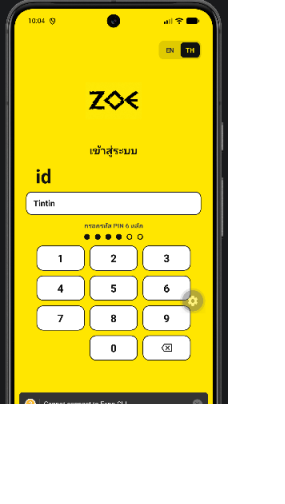
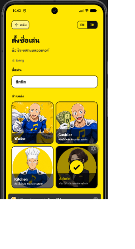
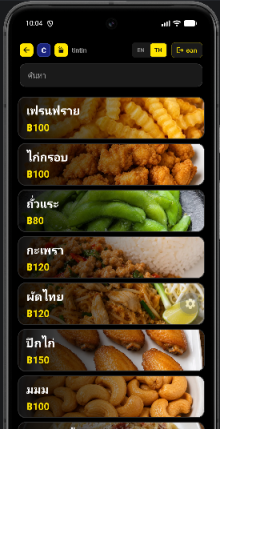
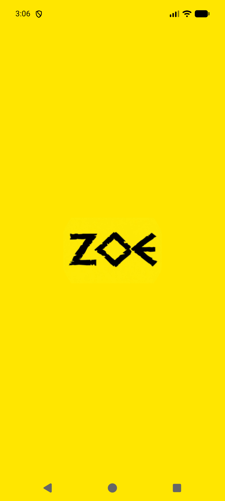
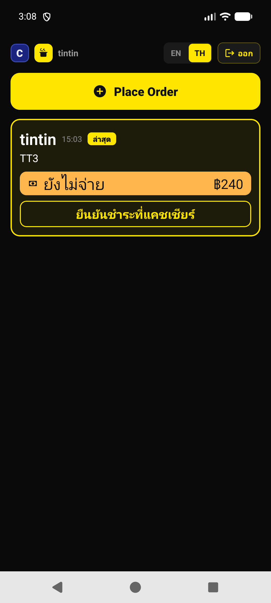
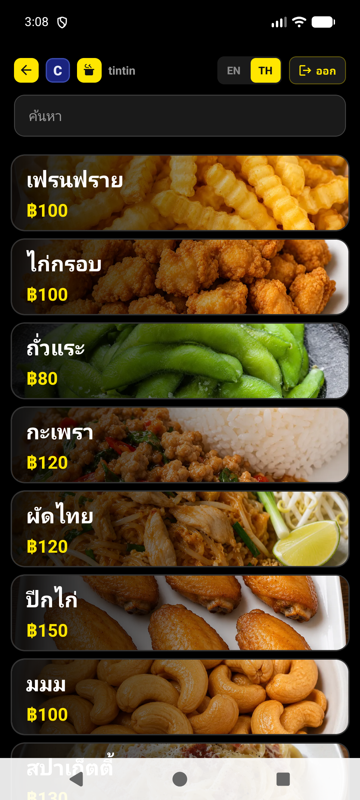
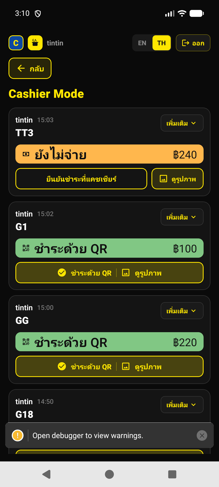
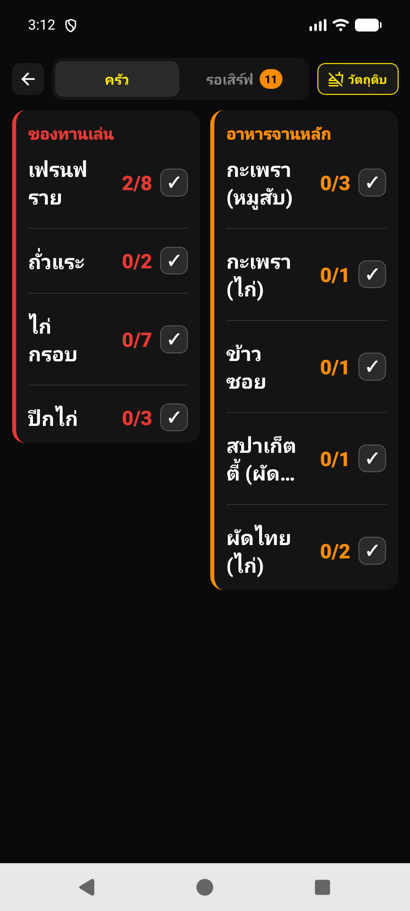
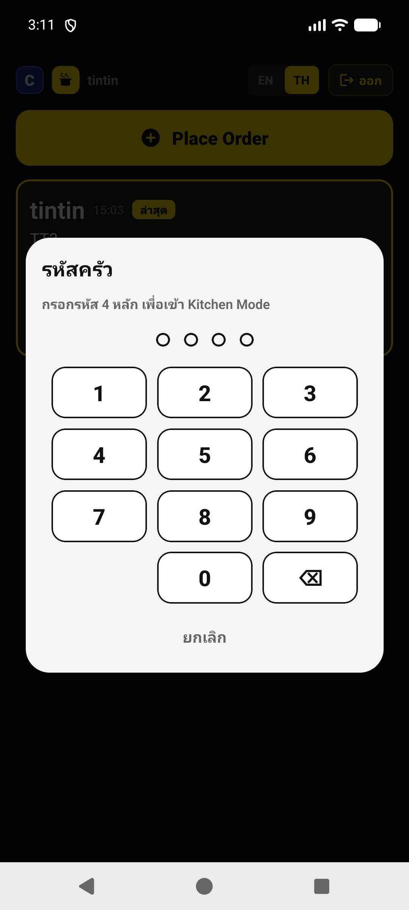

# ZoE

POS / kitchen app สำหรับร้านอาหาร — สั่งอาหาร · เก็บเงิน · ส่งครัว บน Android (Expo React Native)

<p align="center">
  
</p>

## ภาพหน้าจอล่าสุด

Login / PIN · ตั้งชื่อเล่น & ตำแหน่ง · เมนูอาหาร

<p align="center">
  
  &nbsp;
  
  &nbsp;
  
</p>

| หน้าจอ | รายละเอียด |
|--------|------------|
| **Login** | กรอก id + PIN 6 หลัก · สลับภาษา EN/TH |
| **ตั้งชื่อเล่น / ตำแหน่ง** | เลือก Waiter · Cashier · Kitchen · Admin |
| **เมนูอาหาร** | รายการเมนู + ราคา · ค้นหา · ธีมมืด |

---

## ภาพรวมหน้าจอ

| หน้า | หน้าที่ |
|------|---------|
| **Place Order** | หน้าหลักพนักงาน — สั่งใหม่ + บิลเงินสดที่ยังไม่จ่ายของตัวเอง |
| **Menu** | เลือกเมนู / ตัวเลือก / ไข่ / โน้ต |
| **Confirm Order** | ยืนยันโต๊ะ + ชำระเงิน (เงินสด / QR + ถ่ายหลักฐาน) |
| **Cashier Mode** | ดูการชำระของพนักงานทุกคน · ยืนยันเงินสด · ดูรูป QR |
| **Kitchen** | รวมยอดทำครัว / รอเสิร์ฟ · สลับวัตถุดิบหมด |
| **Login** | nickname + PIN 6 หลัก |

### Splash



### Login / PIN


### ตั้งชื่อเล่น & ตำแหน่ง


### เมนูอาหาร


### Place Order (พนักงาน)



### Menu



### Cashier Mode



### Kitchen Mode



### เข้าครัว (PIN)



---

## คุณสมบัติหลัก

- **Login / session** — บัญชีตัวอย่าง `tintin` / PIN `597200` · ค้างล็อกอินในเครื่อง
- **Place Order** — แสดงเฉพาะบิลเงินสดของตัวเองที่ยังไม่จ่าย · ยืนยันชำระด้วย PIN
- **Cashier (ปุ่ม C)** — เห็นบิลทุกคน · unpaid ขึ้นก่อน · ดูรูปหลักฐานได้
- **Kitchen (ไอคอนหม้อ)** — ต้องใส่ PIN · รวมจำนวนตามเมนู · เช็คเสร็จ / เสิร์ฟ
- **No Ingredient** — ปิดวัตถุดิบ / เมนูที่หมด → เมนู sold out บนหน้าสั่ง
- **EN / TH** — สลับภาษาได้จากแถบบน
- **ค้นหาเมนู** — รองรับชื่อ EN/TH และ **aliases** (เช่น `Khao soi`, `Kao Soi`)

---

## สแตก

- Expo ~57 · React Native 0.86 · TypeScript
- AsyncStorage (session, cart cache, availability · สำรอง tickets)
- **Supabase** (ออเดอร์กลาง — หลายเครื่อง / คนละ Wi‑Fi / เน็ตมือถือ)
- expo-splash-screen · expo-font · expo-image-picker · expo-file-system

---

## โครงสร้างโฟลเดอร์

```
ZoE/
├── App.tsx                 # นำทางจอ + splash / hydrate
├── index.ts                # preventAutoHide + early session
├── screens/                # Login, PlaceOrder, Menu, Confirm, Cashier, Kitchen, …
├── components/             # StaffNav, PinModal, …
├── data/                   # menu.ts, kitchen.ts, ingredients.ts
├── utils/                  # storage, supabase, orderSync, …
├── supabase/schema.sql     # ตาราง orders บน Supabase
├── assets/                 # ไอคอน, ฟอนต์, รูปเมนู
└── docs/screenshots/       # ภาพประกอบ README
```

---

## Sync ออเดอร์ (Supabase) — ให้หลายเครื่องเห็นบิลเดียวกัน

ถ้า**ยังไม่มี** `.env` แอปยังทำงานเครื่องเดียวเหมือนเดิม (AsyncStorage)

### 1) สร้างตารางบน Supabase

1. เปิด [supabase.com](https://supabase.com) → สร้างโปรเจกต์
2. ไป **SQL Editor** → วางไฟล์ [`supabase/schema.sql`](supabase/schema.sql) → Run
3. ไป **Database → Publications → supabase_realtime** → เปิดตาราง `orders`

### 2) ใส่คีย์ในแอป

คัดลอก `.env.example` เป็น `.env` แล้วใส่ค่าจาก **Project Settings → API**:

```env
EXPO_PUBLIC_SUPABASE_URL=https://xxxx.supabase.co
EXPO_PUBLIC_SUPABASE_ANON_KEY=eyJhbGciOi...
```

รีสตาร์ท Metro (`npx expo start`) หลังแก้ `.env`

### 3) ทดสอบ

เครื่อง A สั่งอาหาร → เปิด Table Editor ดูแถวใน `orders`  
เครื่อง B (ครัว/แคชเชียร์) ควรเห็นออเดอร์เดียวกัน

---

## เริ่มใช้งาน

ต้องมี Android emulator หรือเครื่องจริง + [Android SDK / adb](https://developer.android.com/studio)

```powershell
cd ZoE
npm install
npx expo start
```

รัน native (ครั้งแรกหรือหลังแก้ Android):

```powershell
npx expo run:android
```

บัญชีทดสอบหลังเปิดแอป (ถ้ายังไม่ล็อกอิน):

| ช่อง | ค่า |
|------|-----|
| id | `tintin` |
| PIN | `597200` |

---

## ทางลัดในแอป

| ปุ่ม | การทำงาน |
|------|----------|
| **+ Place Order** | ไปหน้าเมนู |
| **C** | เข้า Cashier Mode (มี Confirm) |
| **หม้อ** | ใส่ PIN เข้า Kitchen Mode |
| **EN / TH** | สลับภาษา |
| **ออก** | ออกจากระบบ |

---

## โน้ตสำหรับนักพัฒนา

- Ticket / cart / วัตถุดิบหมด ถูกเก็บในเครื่อง (AsyncStorage) — รีสตาร์ทแอปแล้วยังอยู่
- หน้า Menu / Cashier / Kitchen โหลดแบบ lazy หลัง splash เพื่อให้เปิดแอปเร็วขึ้น
- ช่วงเปิดแอป: splash เหลือง + app-icon · พื้นหลังจอหลักหลังเข้าแอปเป็นสีเข้ม (`#0A0A0A`) เพื่อไม่ให้กระพริบเหลืองตอนเปลี่ยนหน้า

---

## License

Private — ZoE / tintin art design
